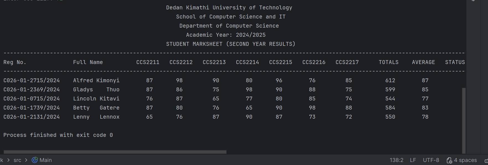

# OOP_work Java Projects

This repository contains two Java programs as part of the OOP assignment.

---

## 1. Main.java – Student Marksheet

**Description:**  
This Java program generates a **student marksheet** for five students. It prompts the user to enter registration numbers, full names, and marks for seven units (CCS 2211 – CCS 2217) for each student.  
It calculates the **total and average marks** and prints a **formatted marksheet** table for all students.

**Screenshot of Program Output:**  

---

## 2. invoice.java – Invoice Generator

**Description:**  
This Java program generates a **formatted invoice**. It collects billing and shipping information, as well as details for up to seven products (product code, name, HSN, quantity, and rate).  
It calculates **amount per product, total, discount (0.6368%), and grand total**, then prints a **well-formatted invoice** showing bill-to and ship-to details side by side, product list, totals, and discount.

**Screenshot of Program Output:**  

---

## How to Run

1. Open the project in **IntelliJ IDEA** or any Java IDE.
2. Compile and run the desired `.java` file.
3. Follow the prompts in the console to enter the required information.
4. View the formatted output directly in the console.

---

## Folder Structure

OOP_work/
├─ src/
│   ├─ Main.java
│   └─ invoice.java
├─ images/
│   ├─ main_output.png
│   └─ invoice_output.png
└─ README.md

> Place screenshots in the `images/` folder and ensure the Markdown links match the filenames.

---

## Notes

- The programs use **console input/output** only.
- Ensure that the correct data type is entered for numeric fields (marks, quantity, rate) to avoid runtime errors.
- Discount in `invoice.java` is calculated as 0.6368% of the total.

---

