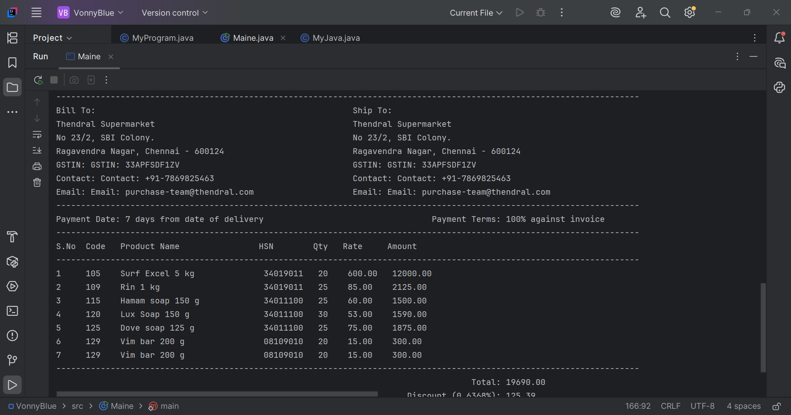

# OOP_work Java Projects

This repository contains three Java programs as part of the OOP assignment.

---

## 1. invoice1.java – Static Invoice Example

**Description:**  
This Java program prints a **static, formatted invoice**. The invoice includes billing and shipping details, a product list with quantity, rate, tax, amount, and totals including discount.  
The invoice is predefined and does **not** take user input.

**Screenshot of Program Output:**  

---

## 2. invoice2.java – Invoice Generator (Dynamic)

**Description:**  
This Java program generates a **formatted invoice dynamically**. It collects billing and shipping information, as well as details for up to seven products (product code, name, HSN, quantity, and rate) from the user.  
It calculates **amount per product, total, discount (0.6368%), and grand total**, then prints a **well-formatted invoice** showing bill-to and ship-to details side by side, product list, totals, and discount.

**Screenshot of Program Output:**  

---

### Comparison: invoice1.java vs invoice2.java

| Feature | invoice1.java (Static) | invoice2.java (Dynamic) |
|---------|------------------------|------------------------|
| Input Type | Predefined invoice; no user input | User inputs billing, shipping, and product details |
| Number of Products | 7 predefined products | Up to 7 products (user-defined) |
| Total & Discount | Pre-calculated | Calculated dynamically |
| Use Case | Demonstrates invoice format only | Simulates real invoice generation |
| Flexibility | Low – fixed values | High – any values can be entered |

---

## 3. Main.java – Student Marksheet

**Description:**  
This Java program generates a **student marksheet** for five students. It prompts the user to enter registration numbers, full names, and marks for seven units (CCS 2211 – CCS 2217) for each student.  
It calculates the **total and average marks** and prints a **formatted marksheet** table for all students.

**Screenshot of Program Output:**  

---

## How to Run

1. Open the project in **IntelliJ IDEA** or any Java IDE.
2. Compile and run the desired `.java` file.
3. For `invoice2.java` and `Main.java`, follow the prompts in the console to enter the required information.
4. For `invoice1.java`, simply run the program to view the static invoice.
5. View the formatted output directly in the console.

---

## Folder Structure

OOP_work/
├─ src/
│ ├─ invoice1.java
│ ├─ invoice2.java
│ └─ Main.java
├─ images/
│ ├─ invoice1_output.png
│ ├─ invoice2_output.png
│ └─ main_output.png
└─ README.md

> Place screenshots in the `images/` folder and ensure the Markdown links match the filenames.

---

## Notes

- The programs use **console input/output** only.
- Ensure that the correct data type is entered for numeric fields (marks, quantity, rate) to avoid runtime errors.
- Discount in `invoice2.java` is calculated as 0.6368% of the total.
- `invoice1.java` demonstrates a **predefined invoice layout** without user input.